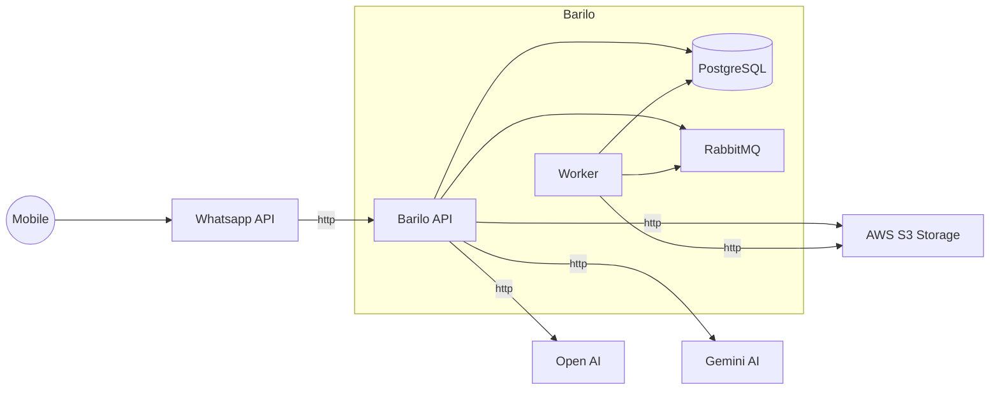
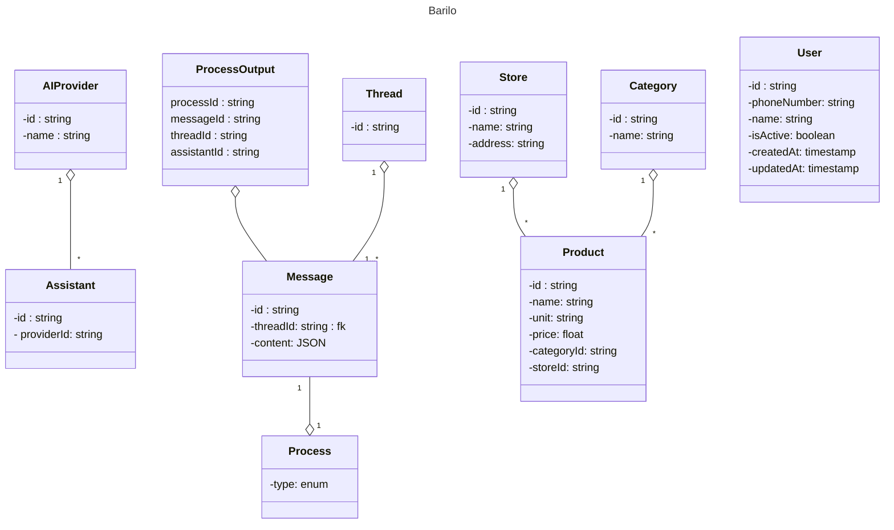
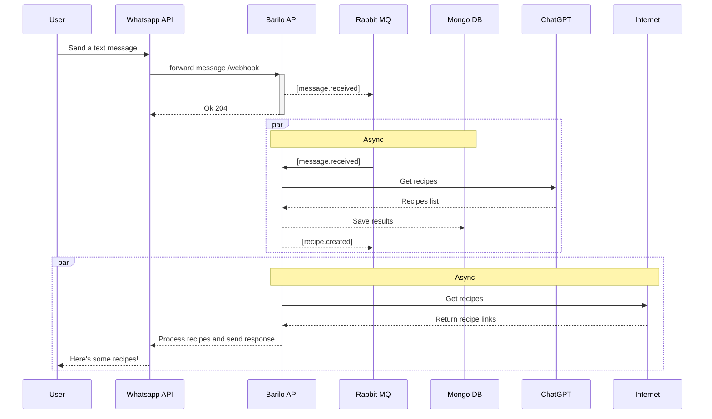

# Barilo

Uma ferramenta que vai te ajudar a economizar dinheiro e tempo entre supermercados e refeições.

## Tech Stack

- Go
- RabbitMQ
- ChatGPT
- PostgreSQL

## Architecture & Design

Aqui estão algumas informações de eu projetei o MPV usando conceitos de DDD.

### Arquitecture choices

- [x] API REST -> Clean Architecture
  - Strategy pattern
  - SOLID
- [x] Workers -> Clean Architecture
  - Strategy pattern
  - SOLID
  
### Design

## Class Diagram

### Whatsapp Conversation Workflow

