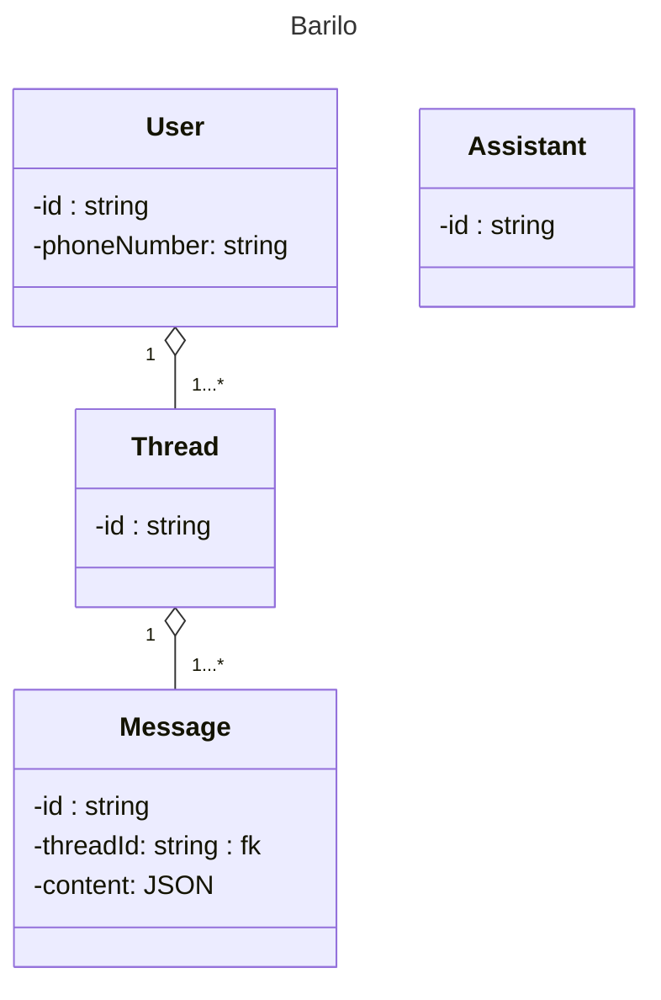

# Barilo

### Architecture

```mermaid
---
title: Barilo
---
classDiagram
  User
  Assistant
  Thread
  Message
  
  User "1" o-- "1...*" Thread
  Thread "1" o-- "1...*" Message  
    
  class User {
    -id : string
    -phoneNumber: string
  }
  class Assistant {
    -id : string
  }
  class Thread {
    -id : string
  }
  class Message {
    -id : string
    -threadId: string : fk
    -content: JSON
  }
```
